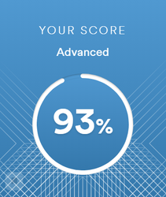

# Yana Malakhova


## Contacts

**Location:** Minsk, Belarus

**Phone:** +375 29 765 36 61

**E-mail:** <malakhova.yana@gmail.com>

**Discord:** Yana Malakhova (@zorro-amarillo)

**Telegram:** [@e_n8t](https://t.me/e_n8t "https://t.me/e_n8t")

**LinkedIn:** <https://www.linkedin.com/in/yanamalakhova/>

********

## Summary

A highly organized, self-motivated Front-end Developer seeking an entry-level position to use my technical skills in coding and troubleshooting complex problems. I have over 4 years of experience in website editing, therefore a significant part of my professional life has been dedicated to working with code and content management systems.

А persistent person with a keen eye for detail, awarded for high efficiency, exceptional diligence, dedication and responsibility in 2018 while working as a website editor.

Able to manage multiple priorities simultaneously and collaborate closely with other team members to create a high-quality end product.

I believe that my experience and knowledge will help me become a valuable addition to a web development team.

********

## Skills
- HTML5, CSS3
- JavaScript Basics
- Git, GitHub
- VS Code
- CMS
- Adobe Photoshop, Adobe Lightroom

********

## Code Examples
```
function disemvowel(str) {
  const result = str.replace(/[aeiou]/ig, '');
  return result;
}
```
********

## Projects

- [CV (сurriculum vitae) ](https://zorro-amarillo.github.io/rsschool-cv/ "CV (сurriculum vitae) ")
- [Portfolio](https://rolling-scopes-school.github.io/zorro-amarillo-JSFEPRESCHOOL/portfolio/ "Portfolio")
- [Eco-sounds](https://rolling-scopes-school.github.io/zorro-amarillo-JSFEPRESCHOOL/js30-1/ "Eco-sounds")
- [Image gallery](https://rolling-scopes-school.github.io/zorro-amarillo-JSFEPRESCHOOL/js30-2/ "Image gallery")
- [Shelter](https://rolling-scopes-school.github.io/zorro-amarillo-JSFE2022Q1/shelter/pages/main/ "Shelter")
- [Travel](https://rolling-scopes-school.github.io/zorro-amarillo-JSFEPRESCHOOL/travel/ "Travel")


********

## Work Experience
[Shate-M Plus](https://shate-m.by "Shate-M Plus Website"):
- Head of PR and Marketing Department (2019-2020),
- Website Editor (2016-2019),
- Head of Customer Sales Department (2013-2016),
- Sales Specialist (2011-2013).

[Mas-Tel](https://yandex.by/maps/org/bomba_internet_tsentr_iooo_mas_tel/1120029198/?ll=27.633400%2C53.911216&z=16 "Mas-Tel Location"):
- Administrator (2009-2010).

********

## Education
**Belarusian State University**, 2005-2010 / Computational Linguistics.

********

## Courses
- [HTML](https://ru.code-basics.com/languages/html "HTML basic course") and [CSS](https://code-basics.com/languages/css "CSS basic course") basic courses on Code Basics (completed)
- [JavaScript](https://ru.code-basics.com/languages/javascript "JavaScript basic course") basic course on Code Basics (completed)
- ["JavaScript/Front-end. Stage 0"](https://rs.school/js-stage0/ "https://rs.school/js-stage0/") course at the Rolling Scopes School (completed)
- ["JavaScript/Front-end"](https://rs.school/js/ "https://rs.school/js/") course at the Rolling Scopes School (in progress)


********

## Languages:
- **English** - Advanced
(according to the [EF Standard English Test](www.efset.org "www.efset.org"))


- **Belarusian** - Native
- **Russian** - Native